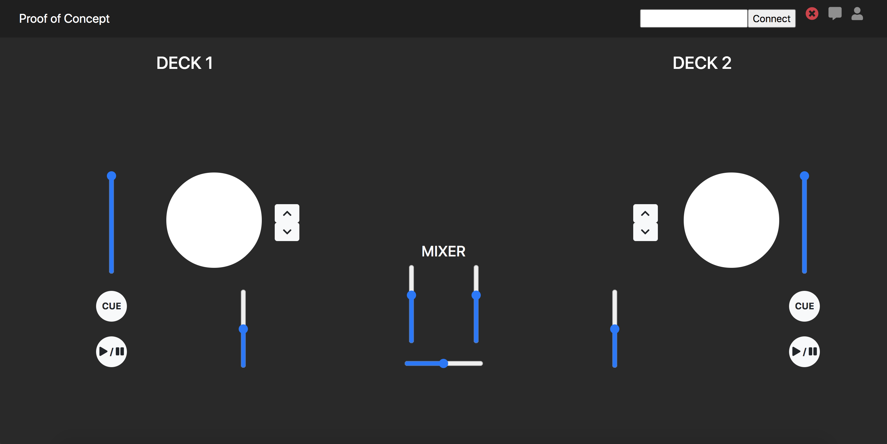

# Current/Future state

## Opportunity statement

# Designing UI

## Moodboard

We drew inspiration from existing DJ softwares.

## User Journeys

As there was no such tools that allowed DJs to collaborate remotely before DJStreamr, the user journey of setting up a Remote Collaborative DJ session was tedious and would most frequently not end up succeeding.

Now, opening a session and connecting to a streaming platform is as easy as it can be:

## Architecture Design

## Evolution of UI

As the project entailed an important technical challenge, we started the project by developing a *Proof of Concept*.

We then used *Adobe XD* to design an interactive prototype. This allowed us to make sure the whole team agreed on the same design choices. We were also able to collect feedback from people using this prototype.

As of today, our product is live on *[djstreamr.com](https://djstreamr.com)* and looks quite similar to our prototype, with the addition of features that we were requested to implement during feedback sessions.

### Evolution of features 

Features' mockups as prototyped             |  Features once implemented
:-------------------------:|:-------------------------:
  |  
 |  
  |  

# People

## Audience

According to
[twitch trends](https://twitchtracker.com/games/26936)
there has been a big rise in the nubmer of viewers of live music streams on
the platform Twitch. On Twitch, this category is predominantly DJ stream
which is very relevant for our project. Upon further research, these trends
also apply to other streaming platforms such as Youtube Live.
   
For these reasons, we think that our product will be of huge benefit for
music listeners online.
 
Researching this stakeholder has directly affected our product. We decided
that the listeners side should be as seamless as possible using platforms
such as Twitch and Youtube. Therefore, we integrated our product such that
the DJs can simply just copy and paste their stream key from their streaming
platform of choice and the audience can seamlessly listen to the performance without even seeing our product directly.

## DJs

This stakeholder is a direct user of our product as they will be the only one
that's using the user interface. We initially researched around the internet
to get an idea of useful our product would be for this stake holder. We later
asked on reddit [How popular would a webapp to enable online b2b
be?](https://www.reddit.com/r/DJs/comments/gmlpf1/how_popular_would_a_webapp_to_enable_online_b2b_be/)
and got an overwhelming positive response that told us that this idea would
be of great benefit for this stakeholder. Our product will allow DJs to
collaborate in a way that wasn't before and therefore opening up more
creative possibilities.

## Record Labels

Another stakeholder in our product would be the record labels. Although this
stakeholder is almost completely indirect as they wouldn't be using the
product themselves, it can still provide a great benefit for them.
Collaboration in music is one of the best ways to attract and grow audiances
as the following of both artists can be mutually shared. We have reached out
to a few record labels and they were very interested in our product as they
want to keep up with the tends and be able to use new opportunities.

# Testing and validation

We did weekly interviews with DJs.

Their feedback changed how we developed our user experience. For example:

Dell the Operator *(Tristan)*:

> Maybe have two sets of faders [...] then I could listen two both tracks at the same, but not the audience.

And so we developed separate [cue faders](#evolutution).

Additional examples includea adding an 'uploaded song list' or showing interactive feedback of a fellow DJ's actinos.

## Impact of DJStreamr

As shown so far, positive feedback and reactions from a wide range of stakeholders is overwhelming.

- Dell the Operator *(Tristan Dell)*:

  > I am surprised at how usable it is. This could really be a thing.
