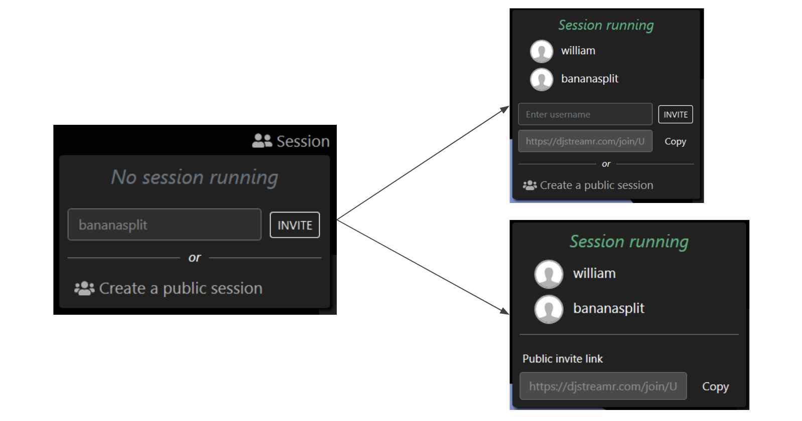

# Current/Future state

## Opportunity statement

# Designing UI

## Moodboard

We drew inspiration from existing DJ softwares.

## User Journeys

As there was no such tools that allowed DJs to collaborate remotely before DJStreamr, the user journey of setting up a Remote Collaborative DJ session was tedious and would most frequently not end up succeeding.

Now, opening a session and connecting to a streaming platform is as easy as it can be:

## Architecture Design

## Evolution of UI

As the project entailed an important technical challenge, we started the project by developing a *Proof of Concept*.

We then used *Adobe XD* to design an interactive prototype. This allowed us to make sure the whole team agreed on the same design choices. We were also able to collect feedback from people using this prototype.

As of today, our product is live on *[djstreamr.com](https://djstreamr.com)* and looks quite similar to our prototype, with the addition of features that we were requested to implement during feedback sessions.

### Evolution of features

Features as prototyped             |  Features once implemented
:-------------------------:|:-------------------------:
  |  
 |  
  |  
